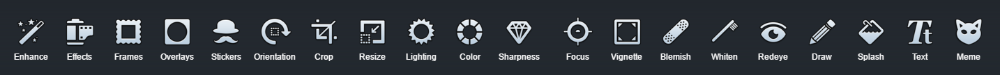

# Aviary Image Editor

## NOTE: UNFORTUNATELY DUE TO API CHANGES I CAN NO LONGER MAKE THIS PLUGIN WORK. DON'T USE THIS PLUGIN ANYMORE AS IT'S NOT CURRENTLY WORKING

The **Aviary** Plugin is for [Grav CMS](http://github.com/getgrav/grav). Aviary image editor integration with the Grav CMS

## Features

Offer a powerful, full-featured image editing UI component that allows your users to edit their photos right within your app with tons of great content and tools such as: 

- Stunning effects and frames. 
- Original high-quality stickers. 
- Beautiful overlays. 
- Fun features like tilt shift and color splash. 
- Pro-level adjustments and more. 

Customize the editor with the perfect combination of tools to create an experience your users will love.

There are many tools available for use:

 
## Installation

### Admin Plugin Installation (Preferred)

The simplest way to install this plugin is via the [Grav Admin Plugin](https://github.com/getgrav/grav-plugin-admin).

### Manual Installation

To install this plugin, just download the zip version of this repository and unzip it under `/your/site/grav/user/plugins`. Then, rename the folder to `aviary`. You can find these files on [GitHub](https://github.com/ricardo118/grav-plugin-aviary) or via [GetGrav.org](http://getgrav.org/downloads/plugins).

You should now have all the plugin files under

    /your/site/grav/user/plugins/aviary
	
> NOTE: This plugin is a modular component for Grav Admin which requires [Grav](http://github.com/getgrav/grav), and the [Admin](https://github.com/getgrav/grav-admin-plugin)  the [Error](https://github.com/getgrav/grav-plugin-error) and [Problems](https://github.com/getgrav/grav-plugin-problems) to operate.

## Configuration

Before using this plugin it should be configured via the Admin Plugin. Configuration is divided into 3 simple tabs.

### Configuration
This is a basic config of the plugin which should let you get up and running.

 - **Plugin Status:** Turn plugin on or off.
 - **Enable in Admin:** Enable plugin in `Admin Pages`
 - **Enable in Site:** Enable plugin in `User Site` (not working)
 - **Editor's Language:** Change the default language
 - **Display Image Size:** Display the image size in the editor in pixels.

### Developer
This is configuration tab for developers who want to personalize the editor for their clients. Being with more options or less.

 - **Enable CORS:** Turn CORS on or off. This speeds up the editor but requires server setup. Check [ENABLE-CORS.ORG](http://enable-cors.org)
 - **Editor Tools Preset:** Change between tools presets. All, Basic or Custom. Toggle the tools below in `custom tools`. These toggles take no effect unless custom tool preset is selected.
 - **Crop Presets:** Add your own custom crop presets. (This will override the default ones). Presets can be done in either Ratio e.g. `3:2` or in pixels `400x500`.
 - **Disable Inverting Crops:** Disables the possibility to invert a crop by clicking twice. So a preset `4:3` cant be swapped to `3:4`
 - **Set Image Quality:** Set the JPG image quality on save.

### Themes
This is a advanced configuration of themes.

 - **Pick a theme:** Select between Light, Dark or Minimum themes. Custom will activate the custom CSS below.
 - **Custom CSS:** Changes made here will take in effect on the editor's look. Please note some attributes may require an `!important`.

## Usage

To use the plugin, install and set up the options as needed. All the options contain explanations on Hover or below the option. Once the editor is configured to your liking, you can use it by going to `pages` in the Admin plugin. While editing a page, you will be able to upload a picture and a little edit icon will appear next to your images. You can then proceed to edit and save the picture. The plugin will do the rest.

## Credits

**Shoutout to [Olevik](https://olevik.me/)** for the huge help in the making of this plugin. Check out his many Grav plugins [here](https://github.com/OleVik)

## Requests

If you would like to request features or have issues, please contact via github issues here or send me an email.

## Todo

- [ ] Update plugin to have production and development mode
- [ ] Allow users to edit Images while in User Site not just in Admin
- [ ] Allow user to decide whether to overwrite the image or create a new image on the same location.
- [ ] Allow for custom API Keys.
- [ ] Create new Theme Presets
- [ ] Create new Tools Presets.
